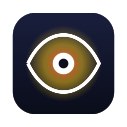

<div align="center">


<br>

<a href="https://github.com/pikabrofar/sentidoS/releases"></a>
<a href="https://gumroad.com/l/hamkad"></a>


**[Download](https://github.com/pikabrofar/sentidoS/releases)** ·
**[Modules](#modules)** ·
**[Controls](#controls)** ·
**[Privacy](PRIVACY.md)** ·
**[Build from source](#build-from-source)**

</div>

---

Humanity is a tiny menu bar app for controlling your Mac with your **eyes**,
**hands** and **voice**, using just the webcam and microphone you already have.
Video and audio are processed on your Mac with Apple's own frameworks. There's
no account, no subscription and no license key: it's free and open source.

## Modules

<table>
<tr>
<td width="33%" valign="top" align="center">
<br>
<h3>OculOS</h3>
<b>Eye tracking</b><br>
<sub>A calibrated gaze cursor, hotkey or optional dwell clicks that snap to buttons, gaze recordings and heatmaps.</sub>
</td>
<td width="33%" valign="top" align="center">
<br>
<h3>ManOS</h3>
<b>Hand-gesture mouse</b><br>
<sub>Point with your palm, pinch to click, drag and scroll, and flick a V sign to jump between videos.</sub>
</td>
<td width="33%" valign="top" align="center">
<br>
<h3>Murmur</h3>
<b>Voice</b><br>
<sub>Hold-to-talk dictation into any app, voice notes with summaries, and meeting transcripts with speaker labels.</sub>
</td>
</tr>
</table>

<div align="center">
<br>
<sub><b>Humanity</b> holds all three in one menu bar app, sharing one camera. With OculOS and ManOS both on, you can <b>look at a button and pinch to click</b>.</sub>
</div>

## How it works


- **Eyes:** Vision face landmarks and a gradient-based pupil detector feed a
  geometric gaze model. You calibrate it once with a 9-point grid, a moving
  target and a head-motion pass.
- **Hands:** Vision hand pose, smoothed with a 1€ filter. Pinches are judged
  against your own calibrated hand, and each click is timed to the start of
  the pinch.
- **Voice:** Apple's on-device speech recognizer. Meetings add on-device speaker
  separation, and you can choose to remember voices with the person's
  consent.

## Install

1. Download **Humanity** (or a single module) from
   [Releases](https://github.com/pikabrofar/sentidoS/releases) and drag it to
   Applications.
2. Open it once and click **Done**. Humanity isn't notarized by Apple yet.
3. Open **System Settings → Privacy & Security**, click **Open Anyway** and enter
   your password.
4. Follow the one-minute Quick Setup. Every permission is granted once, to
   Humanity.

Humanity is **free**: nothing is locked, and paying changes nothing. If it's
useful to you, you can [support development](https://gumroad.com/l/hamkad) with
an optional donation.

## Controls

| Shortcut / gesture | What it does |
|---|---|
| <kbd>⌃</kbd><kbd>⌥</kbd><kbd>⌘</kbd><kbd>H</kbd> | Turn hand control on or off (kill switch) |
| <kbd>⌃</kbd><kbd>⌥</kbd><kbd>⌘</kbd><kbd>D</kbd> | Hold to dictate, release to insert the text. Tap to start or stop |
| <kbd>⌃</kbd><kbd>⌥</kbd><kbd>⌘</kbd><kbd>G</kbd> | Click where you look |
| <kbd>⌃</kbd><kbd>⌥</kbd><kbd>⌘</kbd><kbd>E</kbd> | Turn dwell clicking on or off |
| <kbd>Esc</kbd> | Cancel dictation or a dwell click |
| Open hand, move palm | Move the pointer |
| Thumb + index pinch | Click; hold and move to drag |
| Thumb + middle pinch | Right-click; hold and move to scroll |
| Fist | Hold the pointer still while you reposition |
| V sign, flick up or down | Next or previous video, page or slide |

Your real mouse always takes over, and the menu bar panel shows what's on.

## Privacy at a glance

- **Never uploaded:** camera video and microphone audio.
- **Stays on your Mac:** calibration, recordings, transcripts and voice
  profiles. Delete it all from Settings → Data.
- **Over the network:**
  - a one-time download of the speaker-separation models;
  - transcript text sent to an AI provider, only if you add your own key.
- **Not included:** no analytics, telemetry or crash reporting.

[PRIVACY.md](PRIVACY.md) lists exactly what is stored and for how long.

## Build from source

Requires macOS 14+, and Xcode 16+ or just the Command Line Tools with Swift 6.

```sh
git clone https://github.com/pikabrofar/sentidoS.git
cd sentidoS/Sentidos && make run      # the all-in-one app
```

| Package | What's inside |
|---|---|
| [OculOS](OculOS/) | `GazeKit` (camera, gaze model, calibration) and `OculOSUI` |
| [ManOS](ManOS/) | `HandKit` (pose, gestures, pointer mapping) and `ManOSUI` |
| [Murmur](Murmur/) | `MurmurKit` (dictation, notes, cleanup) and `MurmurUI` |
| [MeetingKit](MeetingKit/) | Call capture, speaker separation, voice profiles |
| [AIKit](AIKit/) | Optional bring-your-own-key AI (Groq, Gemini, OpenAI, Anthropic, Ollama…) |
| [Humanity](Humanity/) | The menu bar app that hosts them all |

`make test` runs each package's tests, and `scripts/package.sh <App>` builds a DMG.

<details>
<summary><b>Keeping permissions across rebuilds</b></summary>

Local builds are ad-hoc signed, with the signing requirement pinned to the
bundle ID, so macOS keeps your camera and Accessibility grants after a rebuild.
Don't share these builds. For a stable signature, create a code-signing
certificate named **Humanity Self-Signed** in Keychain Access (Certificate
Assistant → Create a Certificate → Code Signing), then build with
`SIGN_ID="Humanity Self-Signed" make app`.
</details>

## Limitations and safe use

- Humanity is general-purpose input software, **not a medical or assistive
  device**. Keep a keyboard and mouse or trackpad available, and don't rely on
  it for anything urgent or safety-critical.
- Webcam tracking is approximate (OculOS typically lands within 2–5°) and can
  misread you, so clicks and keystrokes can land in the wrong place.
- Recording a call or saving someone's voiceprint may require their consent by
  law. In Massachusetts and several other states, everyone on a call must agree.
  The app asks you to confirm before each recording.

## Research

The design draws on [22 research notes](research/README.md) covering competing
products, HCI literature, accessibility, Apple APIs, privacy and distribution.

## Contributing

Issues and pull requests are welcome. See [CONTRIBUTING.md](CONTRIBUTING.md).

## License

[MIT](LICENSE). Third-party components are listed in
[THIRD_PARTY_NOTICES.md](THIRD_PARTY_NOTICES.md), and use of the project's
names is covered in [TRADEMARKS.md](TRADEMARKS.md). See also the [Terms of Use](TERMS.md).

<sub>Humanity is not affiliated with or endorsed by Apple. Mac and macOS are trademarks of Apple Inc.</sub>
